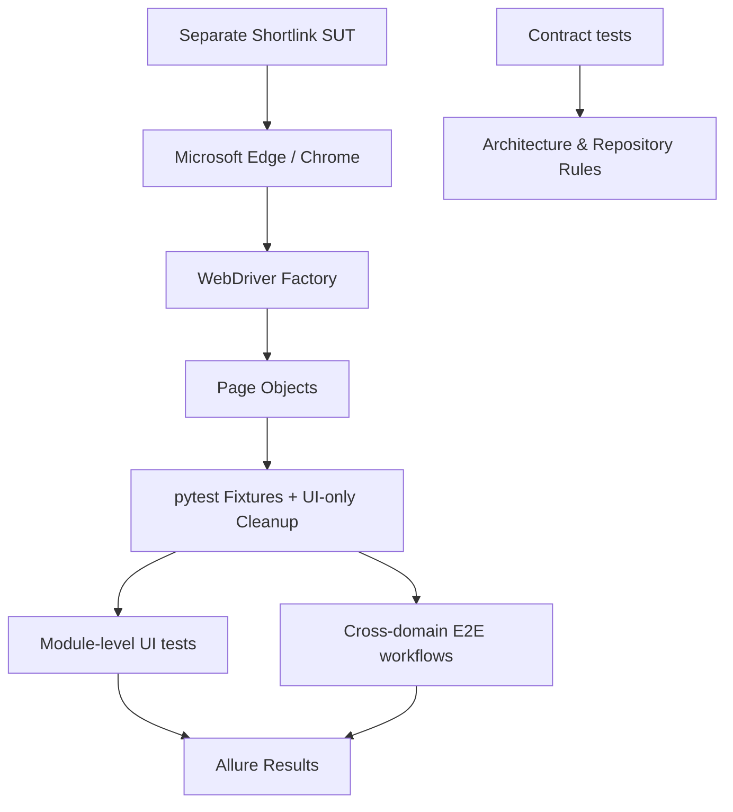

# Shortlink UI Automation

一个面向真实 Shortlink Web 系统的 UI 自动化测试项目。项目使用 **Python + pytest + Selenium + Page Object + Allure**，重点不是堆叠脚本数量，而是验证浏览器自动化在真实业务生命周期中的可维护性、可诊断性和稳定性。

本仓库只包含自动化测试工程。Shortlink 前端、后端属于独立的 **SUT (System Under Test)**，不随本仓库发布，也不要求测试代码依赖 SUT source 才能运行。

## 项目概览

测试从真实浏览器行为出发，覆盖 Authentication、Group、Short Link、Recycle Bin、Account，并通过跨模块 E2E workflow 验证业务状态在多个页面和多个会话之间是否保持一致。

当前测试分为三层：

- **Contract tests**：离线执行，约束自动化框架结构、同步策略、测试分层、仓库边界和报告配置，不需要浏览器或 SUT。
- **Module-level UI tests**：34 条浏览器测试，验证单个业务模块的主要行为。
- **Cross-domain E2E**：6 条跨业务 workflow，将已验证的 Page Object 组合为真实用户生命周期。

当前真实浏览器回归基线共 **40** 条：**38 passed，2 xfailed**。两个 strict expected failure 均对应已经复现并定位的前端校验缺陷，不通过 `skip` 或放宽断言隐藏问题。

| Layer | Count | Runtime |
| --- | ---: | --- |
| Contract tests | 91 | Offline |
| Module-level UI tests | 34 | Browser + SUT |
| Cross-domain E2E | 6 | Browser + SUT |

## Tech Stack

| 类别 | 技术 |
| --- | --- |
| Language | Python 3.11 |
| Test Runner | pytest |
| Browser Automation | Selenium WebDriver |
| Browser | Microsoft Edge（默认），同时支持 Chrome |
| Design | Page Object + pytest Fixtures |
| Synchronization | Explicit Wait / business postcondition |
| Reporting | Allure + failure screenshot |
| CI | GitHub Actions（offline Contract tests only） |

Selenium driver 由 Selenium Manager 解析；浏览器生命周期由 pytest fixture 统一管理。

## 测试架构



核心目录职责：

- `core/`：WebDriver Factory。
- `base/`：页面级通用浏览器操作和 Explicit Wait。
- `page/`：业务 Page Object，集中管理 locator、页面行为和业务后置条件。
- `utils/`：唯一测试数据生成器。
- `tests/contract/`：自动化工程自身的离线 Contract tests。
- `tests/ui/`：按业务域组织的 Module-level UI tests。
- `tests/e2e/`：跨业务 E2E workflows。
- `conftest.py`：浏览器 lifecycle、认证 fixture、UI-only cleanup、失败截图和 Allure hierarchy。

## Test Strategy

### 1. Contract tests

Contract tests 不验证 Shortlink 业务，而是保护自动化项目自身，例如：

- 测试代码不直接泄漏 Selenium locator；
- 不使用 `time.sleep` 作为同步策略；
- Page Object 职责边界保持稳定；
- UI / E2E 不出现完全重复的 test body；
- Statistics 不被误重新加入稳定 UI regression；
- 本地 credentials 和 runtime artifacts 不进入公开仓库；
- GitHub Actions 只运行不依赖 SUT 的离线检查。

因此这部分适合在每次 push / pull request 时作为快速 engineering gate。

### 2. Module-level UI tests

34 条 UI case 分布在：

- Authentication：登录、注册、前端校验和服务端拒绝路径；
- Group：创建、取消、允许空名称、重命名、删除、切换、拖拽排序；
- Short Link：创建、表单校验、编辑、metadata、短链生成与真实 redirect；
- Recycle Bin：回收、恢复、永久删除；
- Account：用户资料读取、邮箱修改与恢复。

### 3. Cross-domain E2E

6 条 E2E 不复制模块 Case，而是验证跨模块 invariant：

1. **Complete Shortlink Lifecycle**  
   Login → create group → create link → edit → real redirect → recycle → unavailable → recover → redirect restored → permanent delete → delete group → logout。

2. **Group-Link Isolation**  
   两个 group 分别创建 link，并验证 group 切换后 link 不发生跨 group 泄漏。

3. **Short URL Identity**  
   修改 origin URL 和 description 后，已有 short URL identity 保持不变，并指向新的 origin URL。

4. **Recycle Recovery Ownership**  
   回收再恢复的 link 必须回到原 group，不能出现在其他 group 中。

5. **Session Lifecycle**  
   Logout 后再次直接访问 protected route，router guard 必须返回 login 页面。

6. **Profile Persistence**  
   修改邮箱 → logout → re-login → 验证修改跨 session 持久化 → 通过真实 UI 恢复原值。

## 稳定性设计

这个项目把“稳定”定义为**同步真实业务状态**，而不是简单延长等待时间。

### Explicit Wait，而不是固定 sleep

项目不使用 `time.sleep` 处理 UI timing。等待对象是页面真实状态，例如：元素可交互、目标 value 已写入、group/link 已出现或消失、页面已进入目标业务状态。

### Persistent business postcondition，而不是瞬时 Toast

创建、编辑、删除等操作优先等待持久业务状态，而不是依赖几秒后就会从 DOM 中移除的成功 Toast。例如 group rename 的完成条件是：

```text
new group present
+
old group absent
```

这种同步方式比等待 `编辑成功` message 更稳定，也更接近测试真正关心的结果。

### Page Object 隔离浏览器细节

业务测试不直接操作 Selenium locator。Element Plus dropdown 的 hover 行为、dialog input、row action、recycle operation 等细节都封装在 Page Object 内部。

### UI-only cleanup

测试数据清理继续通过真实 UI 完成，不直接访问数据库，也没有为了 teardown 增加业务后门。

普通 UI test 由 fixture 管理资源生命周期；E2E 使用 cleanup registry 只登记本 workflow 创建的 mutable resource，在 workflow 中途失败时兜底清理。

### Unique test data

Group、link description、registration data、profile mail 均通过 factory 生成唯一值，降低跨 Case 数据碰撞。

### Failure diagnostics

浏览器 Case 在 call phase 失败时自动采集 screenshot 并附加到 Allure。截图失败不会覆盖原测试 verdict。

## Known SUT Issues

当前保留两个 `strict=True` 的 expected failures。它们不是自动化脚本绕过，也不是为了让报告变绿而 `skip`。

### 1. Login empty username validation

登录表单 username input 所属 `FormItem` 的 `prop` 与实际 `rules` key 不一致，导致空 username 绕过预期 client-side validation。测试以 strict xfail 固定复现条件。

### 2. Registration empty real-name validation

注册表单字段使用 `realName`，而 validation rules 使用不一致的 `realNamee` key，因此空 real name 未被预期规则拦截。该行为同样使用 strict xfail 记录。

如果未来 SUT 修复这些问题，strict xfail 会转为 XPASS 并使测试失败，提醒测试预期需要更新。

## Statistics 为什么不进入稳定回归

Statistics 页面曾进行过真实浏览器验证，但最终**有意排除**在稳定 UI regression 之外。

原因不是“功能不重要”，而是当前 SUT 的统计写入属于 asynchronous eventual consistency，而页面没有提供 deterministic UI synchronization boundary。一次真实 redirect 完成，只能证明访问已经发生，不能证明统计持久化已经在某个确定时刻完成；页面本身也没有 push / auto-poll 来刷新已经读取的 aggregate value。

如果自动化通过反复 refresh / reopen 直到 PV 变化，本质上会变成 blind eventual-consistency retry，增加 flaky 风险。因此本项目选择不伪造稳定性，而是在有明确同步边界之前不把 Statistics 数据断言纳入稳定回归。

## Allure Reporting

Allure reporting concern 集中在 `conftest.py`，业务测试无需逐个 `import allure`。

浏览器测试自动获得：

- Epic：`Shortlink UI Automation`
- Feature：Authentication / Group / Short Link / Recycle Bin / Account / Cross-domain E2E
- Story：根据实际 test module / workflow 生成
- Failure screenshot：Case 失败时自动附加
- Environment：Browser、Base URL、Headless、Python、OS

Allure environment 不写入 username、password、token 或其他 secret。

运行测试后：

```bash
allure serve report
```

需要预先在本机安装 Allure Commandline；Python 依赖中的 `allure-pytest` 负责生成 result files，不等于 Allure CLI 本身。

## 项目结构

```text
shortlink-ui-autotest/
├── .github/
│   └── workflows/
│       └── contract-tests.yml
├── base/
├── core/
├── date/
│   └── login_data.example.json
├── docs/
│   └── sut-setup.md
├── page/
├── tests/
│   ├── contract/
│   ├── e2e/
│   └── ui/
│       ├── account/
│       ├── authentication/
│       ├── group/
│       ├── link/
│       └── recycle/
├── utils/
├── config.py
├── conftest.py
├── pytest.ini
├── requirements.txt
└── README.md
```

## 本地运行

### 1. 准备 Python 环境

建议 Python 3.11：

```bash
python -m venv .venv
```

激活环境后安装依赖：

```bash
pip install -r requirements.txt
```

### 2. 准备独立 SUT

本仓库不包含 Shortlink frontend/backend source。请先在本机或测试环境中独立启动 SUT，并确保 Web frontend 可由浏览器访问。

默认 Base URL：

```text
http://localhost:5174
```

完整配置步骤见 [`docs/sut-setup.md`](docs/sut-setup.md)。

### 3. 配置本地测试账号

复制：

```text
date/login_data.example.json
```

为：

```text
date/login_data.json
```

然后只在本地文件中填写可用账号。真实 `login_data.json` 已被 `.gitignore` 排除。

### 4. 运行测试

Offline Contract tests：

```bash
pytest -q tests/contract
```

只运行 Module-level UI：

```bash
pytest -v -s tests/ui
```

只运行 E2E：

```bash
pytest -v -s tests/e2e
```

完整 Browser regression：

```bash
pytest -v -s tests/ui tests/e2e
```

默认 `pytest.ini` 会把 Allure result 写入 `report/`。

## CI：为什么 GitHub Actions 只跑 Contract tests

GitHub Actions 只执行：

```bash
pytest -q tests/contract
```

原因是 Contract tests 完全离线，可以稳定验证测试工程本身；而 `tests/ui` 与 `tests/e2e` 需要：

- 独立部署的 Shortlink SUT；
- 真实浏览器；
- 有效测试账号；
- 部分真实 redirect / network context。

本项目不会为了 CI 页面“全绿”而伪造一个与真实运行环境不同的 Browser regression。完整 UI/E2E 仍在已准备好的本地或专用测试环境执行。

## Repository Boundary

公开仓库只发布自动化工程本身：framework、Page Objects、tests、public docs、safe example config 和 offline CI。

明确不发布：

- Shortlink frontend source；
- Shortlink backend source；
- `date/login_data.json`；
- password / token / private config；
- `report/`、`log/`、screenshots、cache、IDE files；
- 私人求职材料。

测试运行时只依赖已经部署好的 SUT，不依赖前后端源码目录。

## 设计取舍

本项目不追求“功能越多越好”。已经明确放弃或限制的内容包括：

- 不为单一 SUT 在测试框架核心层增加业务特判；
- 不通过 sleep / blind retry 掩盖同步问题；
- 不直接访问数据库做 UI teardown；
- 不重新加入没有稳定同步边界的 Statistics 数据断言；
- 不为了作品集效果额外 Docker 化 SUT；
- 不把无法在 GitHub hosted runner 上真实运行的 Browser tests 包装成假 CI。

目标是让每一个保留下来的能力都能解释“为什么需要它、它解决了什么工程问题、失败时如何定位”。
